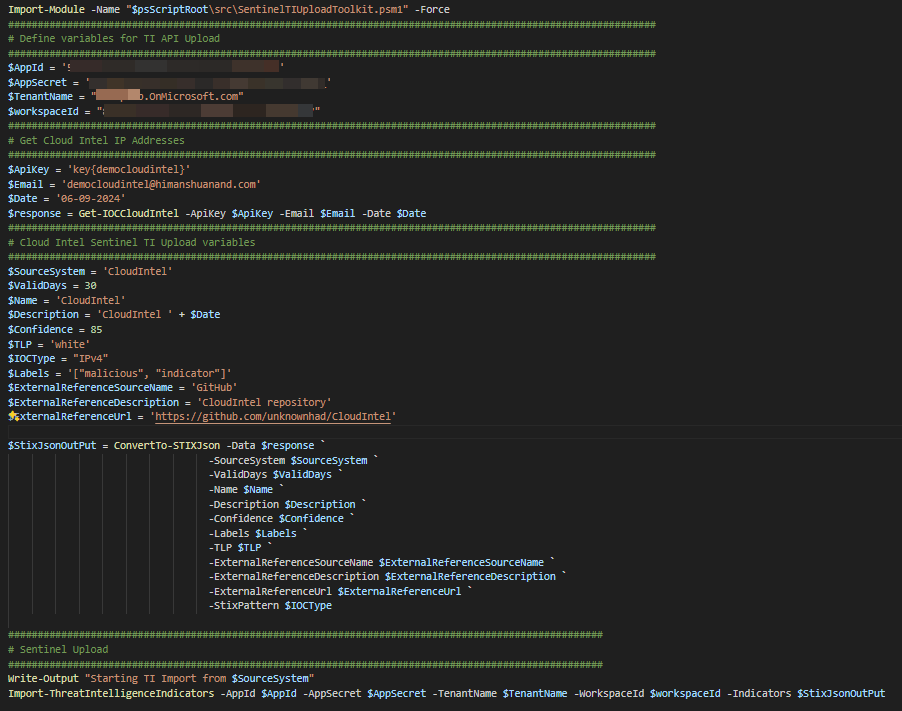
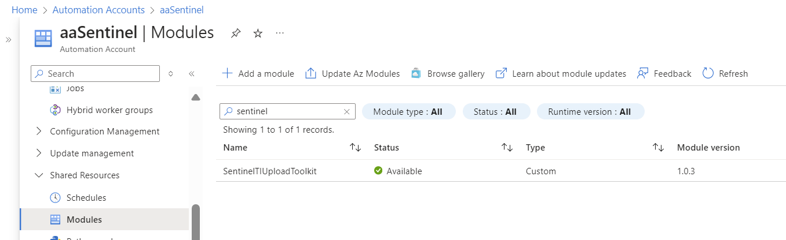
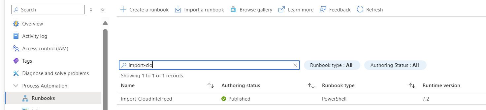
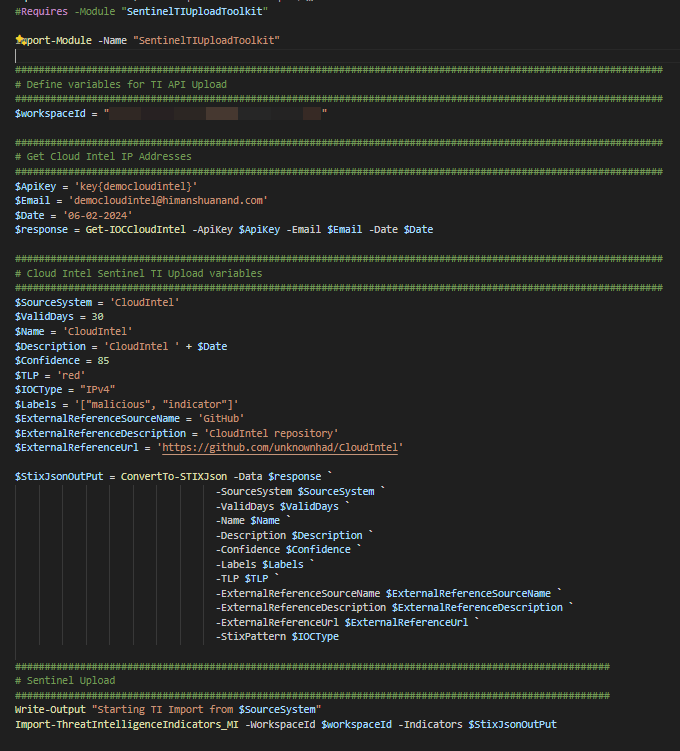
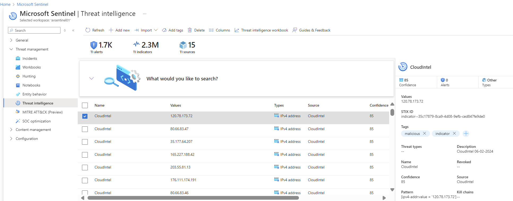
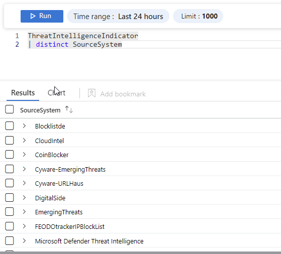
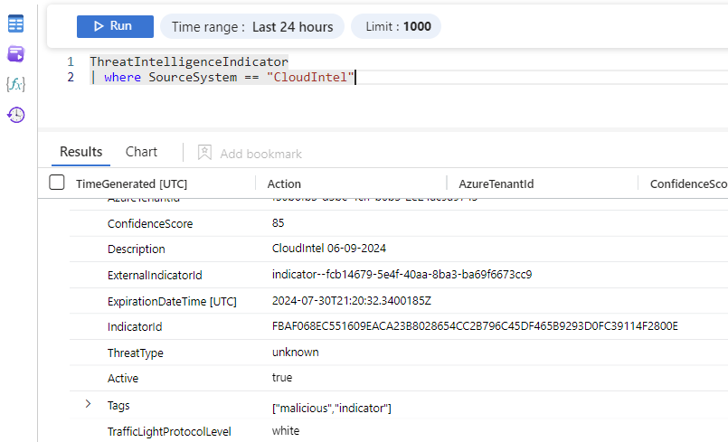

# Sentinel TI Upload Toolkit

Sentinel Threat Intelligence Upload Toolkit

The **Sentinel TI Upload Toolkit** contains a number of PowerShell functions and scripts to import Threat Intelligence IOCs into Microsoft Sentinel using the [upload indicators API](https://learn.microsoft.com/en-us/azure/sentinel/connect-threat-intelligence-upload-api). For more details also see [Reference the upload indicators API (Preview) to import threat intelligence to Microsoft Sentinel](https://learn.microsoft.com/en-us/azure/sentinel/upload-indicators-api)

## Purpose of the toolkit

- Initially I started with just a few scripts while learning and trying to better understand the [STIX](https://docs.oasis-open.org/cti/stix/v2.1/cs01/stix-v2.1-cs01.html#_muftrcpnf89v) indicator format specification and teh [Request Body](https://learn.microsoft.com/en-us/azure/sentinel/upload-indicators-api#request-body) for the API.
- Provide a quick automated process to load custom TI into Microsoft Sentinel
- Use Azure Automation account as an alternative to Azure Logic Apps
- Comparisson and content review of various Open Source TI Feeds

Author: [AlexVerboon](https://twitter.com/alexverboon)

## Module Functions

The Sentinel Threat Intelligence Upload Toolkit **PowerShell Module** includes the following fuctions:

| Function | Description  |
| ----------------------- | -------------------------------------------------------------------------------------- |
| ConvertTo-STIXJson |     Converts a collection of IOCs (Indicators of Compromise) into STIX JSON format. |
| Get-IOCDomainNamesContent | Retrieves domain names from a specified URL (TXT files) |
| Get-IOCIPContent | Retrieves IP Addresses from a specified URL (TXT files) |
| Get-IOCUrlContent | Retrieves Urls from a specified URL (TXT files) |
| Import-ThreatIntelligenceIndicators | Import threat intelligence indicators to Microsoft Sentinel using the Threat Intelligence upload API. Using client credentials for authentication and authorization |
| Import-ThreatIntelligenceIndicators_MI | Import threat intelligence indicators to Microsoft Sentinel using the Threat Intelligence upload API. Using system managed identity for authentication and authorization |

## Scripts

| Script | Description  |
| ----------------------- | -------------------------------------------------------------------------------------- |
| Import-Blocklist-Bots.ps1 | Import [Blocklist.de](https://www.blocklist.de/en/download.html) Bots IOC |
| Import-CloudIntel.ps1 | Import [CloudIntel](https://github.com/unknownhad/CloudIntel) IOC |
| Import-DigitalSide-Threat-Intel.ps1 | Import [DigitalSide](https://osint.digitalside.it/) IOCs |
| Import-OpenPhish.ps1 | Import [OpenPhish](https://openphish.com/) IOcs |

## Azure Automation Account Scripts

| Script | Description  |
| ----------------------- | -------------------------------------------------------------------------------------- |
| AA-Import-CloudIntelFeed.ps1 | Import [CloudIntel](https://github.com/unknownhad/CloudIntel) IOC |

## Initial Setup and Configuration

### Local Scripts

1. Register a Microsoft Entra application and record its application ID.
2. Generate and record a client secret for your Microsoft Entra application.
3. Assign your Microsoft Entra application the Microsoft Sentinel contributor role or equivalent.
4. Install the Threat Intelligence upload indicators API data connector in Microsoft Sentinel (optional)
[Microsoft documentation](https://learn.microsoft.com/en-us/azure/sentinel/connect-threat-intelligence-upload-api#instructions)
5. Within the [Import-Scripts](/Import-Scripts/) folder update the indiidual ps1 scripts.
    - Update the AppID, AppSecret, TenantName and WorkspaceID variables
    - Update the TI Upload variables as per your needs. Description, Name, SourceSystem, Confidence, TLP, Labels (Tags)

6. Run the PowerShell Script

### Azure Automation Account

1. Create an Automation Account in Azure
2. Assign the system managed identity for the Automation Account Microsoft Sentinel contributor role or equivalent.
3. Import the [SentinelTIUploadToolkit](./Module/SentinelTIUploadToolkit.zip) PowerShell Module into the Azure Automation Account Modules

4. Create a Runbook for example "Import-CloudIntelFeed" and paste the code from [AA-Import-CloudINtelFeed](./Import-Scripts-AutomationAccount/AA-Import-CloudIntelFeed.ps1)

5. Update the ***workspaceid*** variable and update other variables as per your needs

6. Start the Runbook

## Threat Intelligence in Microsoft Sentinel

When all works as expected you see the imported TI appear in the Microsoft Sentinel portal and Log Analytics workspace.

## Credits

- [BertJanCyber](https://twitter.com/BertJanCyber) for maintaining the [Open Source Threat Intel Feeds list](https://github.com/Bert-JanP/Open-Source-Threat-Intel-Feeds)
- [Fabian Bader](https://twitter.com/fabian_bader), it's been a while since I created a PowerShell module, so used one of his as a reference.

## To-Do's

- Add Automation Account variables to avoid hardcoded worskpaceid
- Add tutorial for creating new TI feed import scripts
- Create scripts to retrieve content from CSV files
- Create a Schedule for Automation Account Runbooks so that imports happen at the right time
- Add more examples for importing md5 hashes and email IOCs
- Automate PowerShell module ZIP file creation and upload to PowerShell Gallery
- Update Endpoint to https://sentinelus.azure-api.net/{workspaceId}/threatintelligenceindicators:upload (Currently in Preview)
